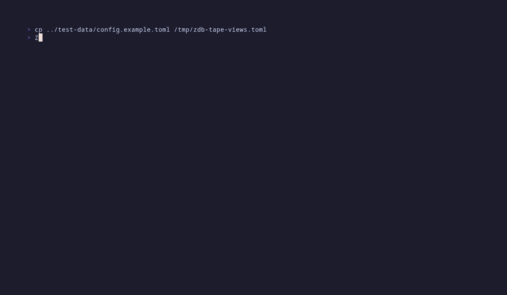
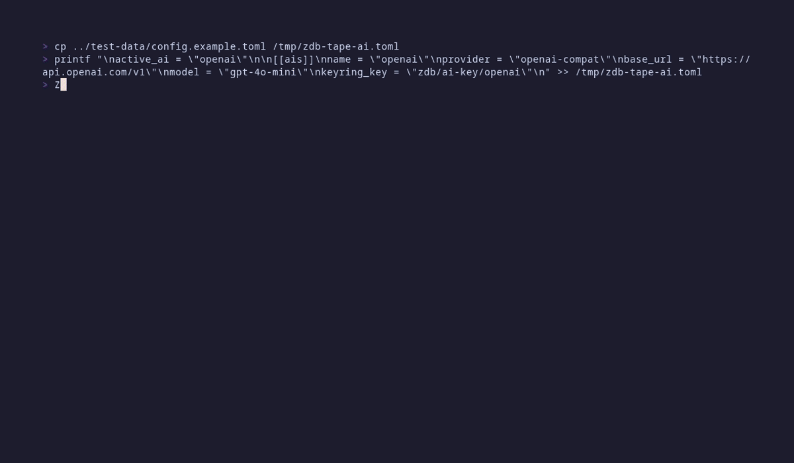

# zDB — Screenshots

A walkthrough of the main views, in roughly the order you encounter them.
Animated demos are auto-generated from the `vhs` tape files in
[`tapes/`](../tapes/README.md); the two AI Ask captures are static PNGs
because they need a live API key.

## Schema browser

Fixed first tab. Connects, then walks down the table list — the right-hand
columns panel updates as you navigate.

## Data viewer with row copy

Anchors a mark with `Space`, then extends the range with `M` so multiple
rows are selected at once. The help bar shows `Y copy 5 marked`.

## Staged edits

Every cell mutation goes into a staged-edits buffer inside an explicit
transaction. This demo edits a `session_date`, stages it, then opens the
review modal showing the pending change.

## Saved views

Opens the SQL editor, types a query, saves it as `students-sample` with
`Ctrl+S`, then reopens the views list to confirm the new entry.

## Ask AI

Natural-language question on any data tab. Read-only SQL auto-executes;
mutating SQL falls back to preview-and-confirm.

## Ask AI — result

The AI answer runs against the active connection and the result table is
shown inline.

## AI profiles → analytics

Opens the AI profiles list (one profile pre-configured), then jumps to
the analytics dashboard with `g` — per-profile token usage, cost
estimates, and the request log are all visible.

