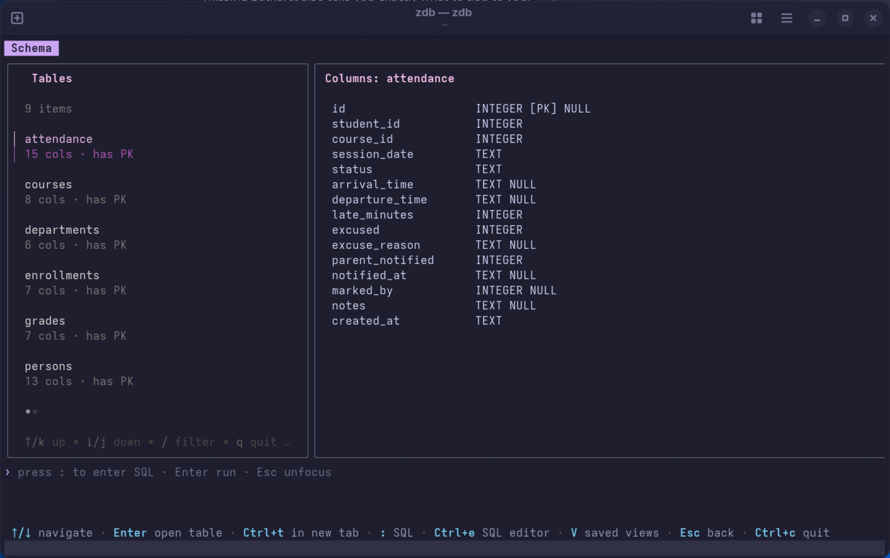
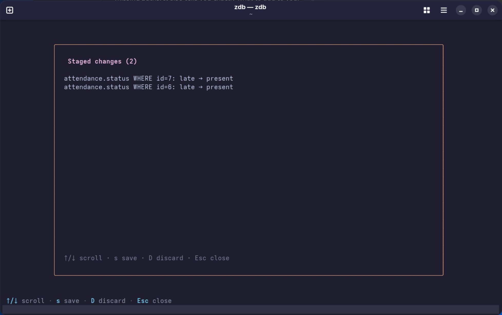
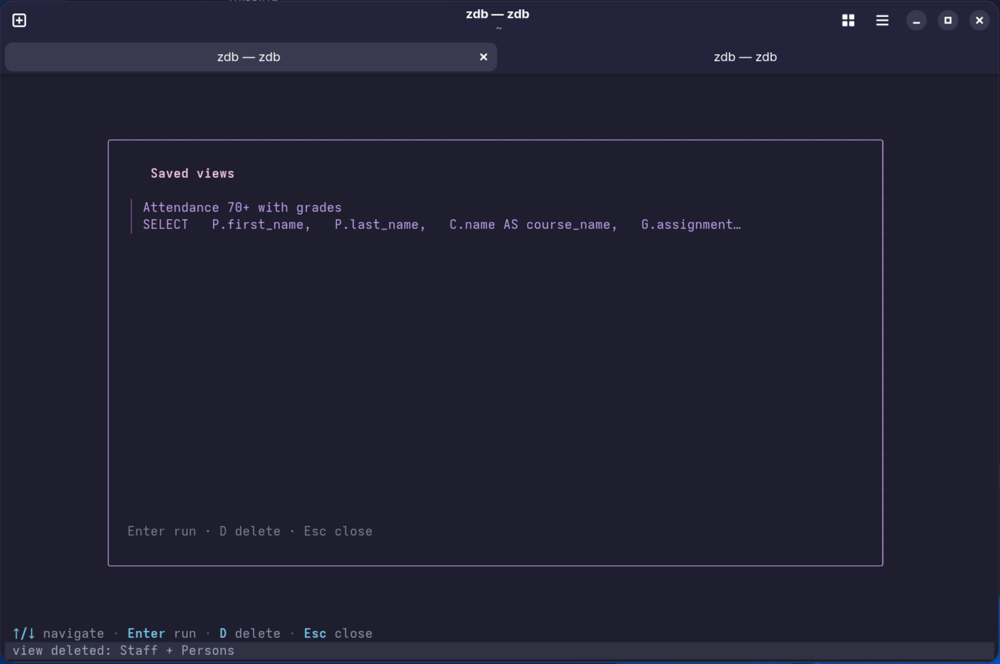
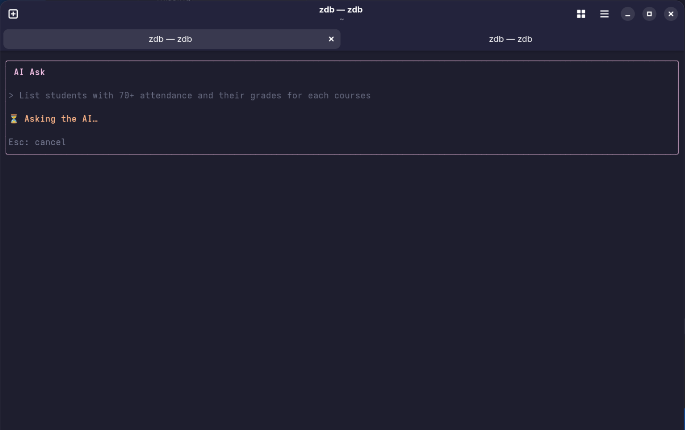
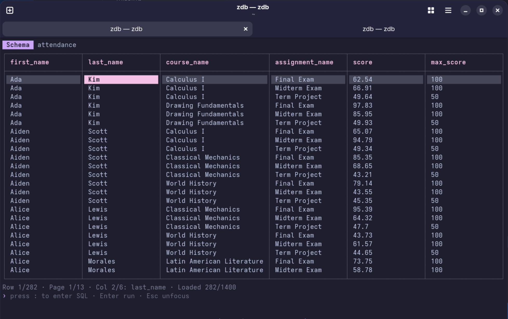
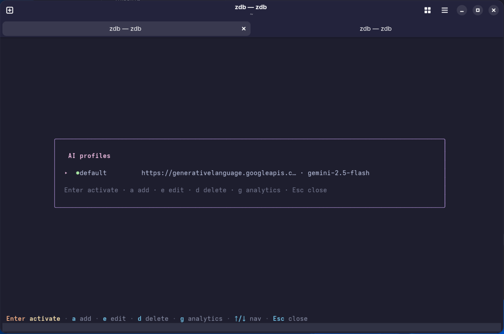
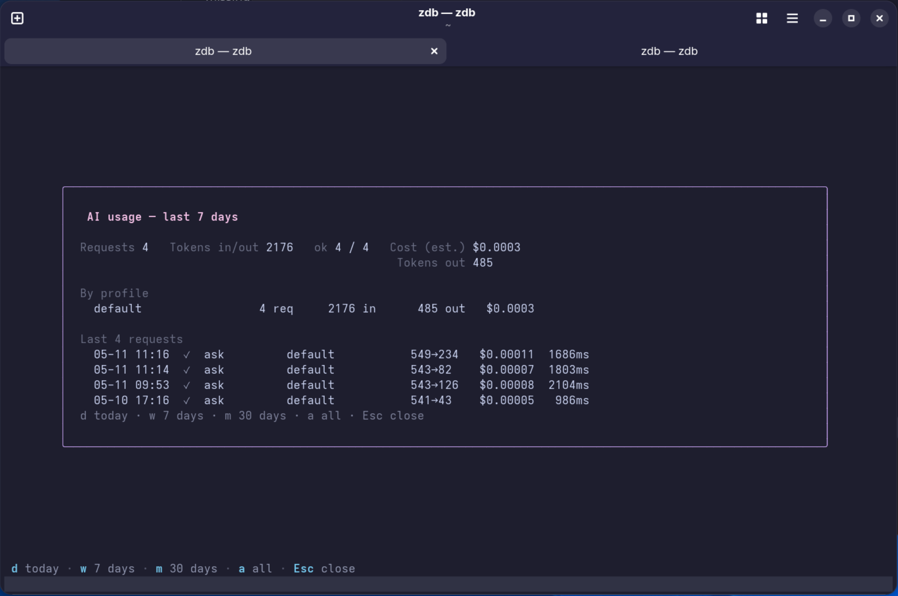

# zDB — Screenshots

A walkthrough of the main views, in roughly the order you encounter them.

## Schema browser

Fixed first tab, lists every table in the active connection. `Enter` opens a table in the current data tab; `Ctrl+T` opens it in a new one.

## Data viewer with row copy

Mark rows with `Space`, copy as TSV (including header) with `Y`. Single-cell copy is `y`.

## Staged edits

Every cell mutation goes into a staged-edits buffer inside an explicit transaction. `S` opens the review modal, `s` commits, `D` discards.

## Saved views

Name and recall frequent queries with `W` (save current SQL as view) and `V` (open the views list).

## Ask AI

Natural-language question on any data tab. Read-only SQL auto-executes; mutating SQL falls back to preview-and-confirm.

## Ask AI — result

The AI answer runs against the active connection and the result table is shown inline.

## AI profiles

Switch between OpenAI, Gemini, Ollama, Groq, or any custom OpenAI-compatible endpoint. The active profile drives every Ask, Suggest, and analytics attribution.

## AI analytics

Per-profile token usage and estimated cost, sourced from the local `~/.local/state/zdb/ai-usage.jsonl` log.

